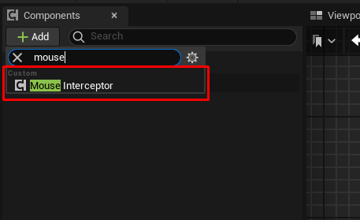
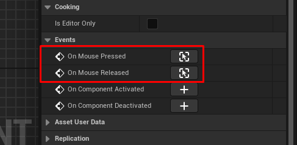
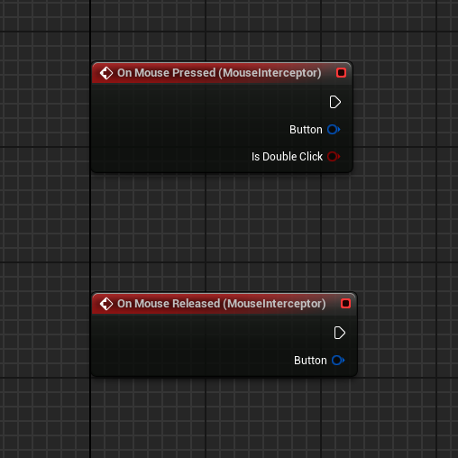
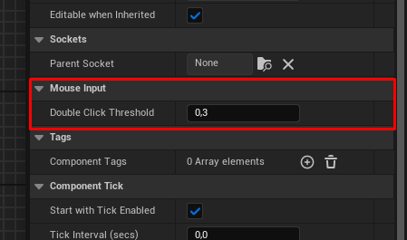
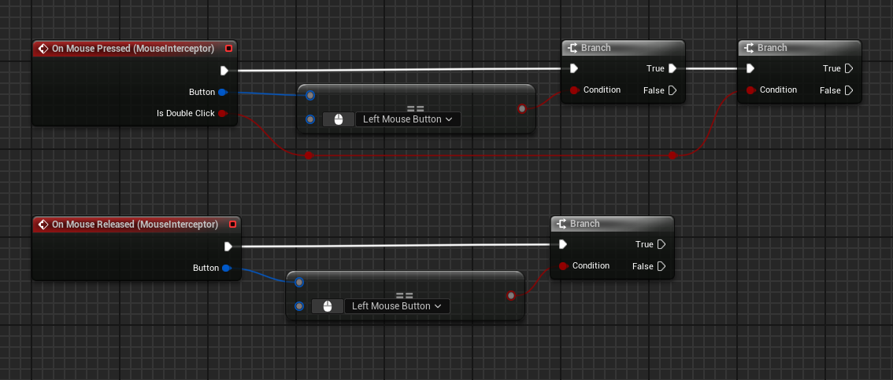

### **Mouse Interceptor Documentation (EN)**

---

## **Overview**
**Mouse Interceptor** is a lightweight Unreal Engine plugin designed for global interception of mouse events. It allows seamless handling of mouse button presses and releases, along with customizable double-click detection. All events are exposed via delegates, making integration with Blueprints straightforward and efficient.

---

## **Features**
- **Global Mouse Event Interception:** Capture all mouse events globally, regardless of the active interface or input state.
- **Customizable Double-Click Detection:** Configure the time threshold for detecting double-clicks dynamically via Blueprints.
- **Blueprint Integration:** Handle mouse events easily through the `OnMousePressed` and `OnMouseReleased` delegates.
- **Lightweight and Efficient:** Operates without requiring ticking, ensuring minimal performance overhead.

---

## **Usage**

### **Adding the Component**
1. Open the actor where you want to use the plugin.
2. Add the `MouseInterceptorComponent`:
   - In the **Components** panel, click **Add Component**.
   - Search for `MouseInterceptorComponent` and add it. 



### **Handling Mouse Events**
1. Bind to the `OnMousePressed` and `OnMouseReleased` delegates in Blueprints:
   - Select the actor with the `MouseInterceptorComponent`.
   - In the **Blueprint Event Graph**, add event nodes for `OnMousePressed` or `OnMouseReleased`.

2. Implement your custom logic:
   - Use the `Button` parameter to determine which mouse button was pressed.
   - Use the `bIsDoubleClick` parameter to handle double-click events.


### **Customizing Double-Click Threshold**
- Use the `SetDoubleClickThreshold` function to adjust the time threshold for detecting double-clicks:
  ```cpp
  MouseInterceptorComponent->SetDoubleClickThreshold(0.5f); // Example: Set to 0.5 seconds
  ```


---

## **Code Modules**
- **MouseInterceptor** [Runtime]

---

## **Supported Platforms**
- **Development Platforms:**
  - Windows 64-bit
  - Mac OS
  - Linux
- **Target Platforms:**
  - Windows 64-bit
  - Mac OS
  - Linux

---

## **FAQ**

### **Q: How do I disable double-click detection?**
**A:** Set the `DoubleClickThreshold` to a very high value (e.g., `10.0f`), effectively disabling the feature.

### **Q: Does this plugin support network replication?**
**A:** No, the plugin processes mouse input on the client side only.

---

## **Example Blueprint Integration**
1. Add the `MouseInterceptorComponent` to an actor.
2. In the **Blueprint Event Graph**, handle the `OnMousePressed` event:
   ```plaintext
   Event OnMousePressed
       -> Branch: Is Double Click?
           True: Print "Double Click!"
           False: Print "Single Click!"
   ```


---

## **License**
This plugin is distributed under the [Creative Commons Attribution 4.0](https://creativecommons.org/licenses/by/4.0/) license.

---

---

# **Mouse Interceptor — Документация (RU)**

---

## **Обзор**
**Mouse Interceptor** — это лёгкий плагин для Unreal Engine, предназначенный для глобального перехвата событий мыши. Он позволяет обрабатывать нажатия и отпускания кнопок мыши, а также настраивать порог двойного клика. Все события передаются через делегаты, что делает интеграцию с Blueprints простой и эффективной.

---

## **Особенности**
- **Глобальный перехват событий мыши:** Позволяет захватывать все события мыши, независимо от активного интерфейса или состояния ввода.
- **Настраиваемый порог двойного клика:** Вы можете динамически изменять интервал времени для определения двойного клика через Blueprints.
- **Интеграция с Blueprints:** Лёгкая обработка событий мыши через делегаты `OnMousePressed` и `OnMouseReleased`.
- **Лёгкость и производительность:** Плагин работает без необходимости тиков, обеспечивая минимальную нагрузку на систему.

---

## **Использование**

### **Добавление компонента**
1. Откройте актор, в котором вы хотите использовать плагин.
2. Добавьте компонент `MouseInterceptorComponent`:
   - В панели **Components** нажмите **Add Component**.
   - Найдите `MouseInterceptorComponent` и добавьте его. 


### **Обработка событий мыши**
1. Подключите делегаты `OnMousePressed` и `OnMouseReleased` в Blueprints:
   - Выберите актор, в который вы добавили `MouseInterceptorComponent`.
   - В **Blueprint Event Graph** добавьте узлы событий `OnMousePressed` или `OnMouseReleased`.

2. Реализуйте свою логику:
   - Используйте параметр `Button`, чтобы определить, какая кнопка мыши была нажата.
   - Используйте параметр `bIsDoubleClick`, чтобы обрабатывать события двойного клика.


### **Настройка порога двойного клика**
- Используйте функцию `SetDoubleClickThreshold`, чтобы настроить интервал времени для определения двойного клика:
  ```cpp
  MouseInterceptorComponent->SetDoubleClickThreshold(0.5f); // Пример: Установить 0.5 секунд
  ```


---

## **Модули кода**
- **MouseInterceptor** [Runtime]

---

## **Поддерживаемые платформы**
- **Платформы разработки:**
  - Windows 64-bit
  - Mac OS
  - Linux
- **Целевые платформы сборки:**
  - Windows 64-bit
  - Mac OS
  - Linux

---

## **Часто задаваемые вопросы**

### **Вопрос: Как отключить распознавание двойного клика?**
**Ответ:** Установите `DoubleClickThreshold` в очень большое значение (например, `10.0f`), чтобы фактически отключить эту функцию.

### **Вопрос: Поддерживает ли плагин сетевую репликацию?**
**Ответ:** Нет, плагин обрабатывает события ввода только на стороне клиента.

---

## **Пример интеграции в Blueprints**
1. Добавьте компонент `MouseInterceptorComponent` к вашему актору.
2. В **Blueprint Event Graph** обработайте событие `OnMousePressed`:
   ```plaintext
   Event OnMousePressed
       -> Branch: Is Double Click?
           True: Print "Двойной клик!"
           False: Print "Одиночный клик!"
   ```


---

## **Лицензия**
Этот плагин распространяется под лицензией [Creative Commons Attribution 4.0](https://creativecommons.org/licenses/by/4.0/). 

---
